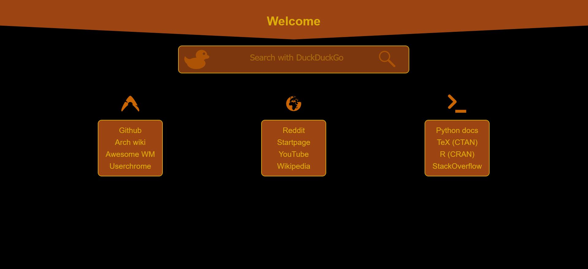

# Firefox-configs
Firefox configurations such as Userchrome, custom home page

Heavily inspired by [Prismatic-Night](https://github.com/3r3bu5x9/Prismatic-Night).
I am still learning CSS/HTML/Javascript, so this is still a work in progress.

